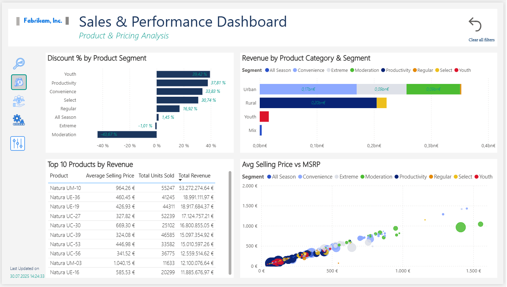
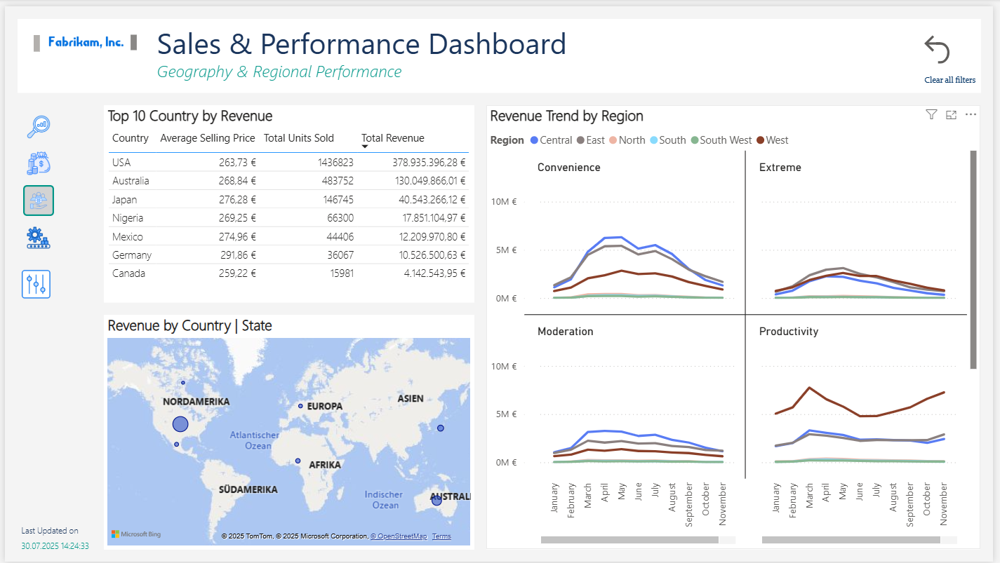
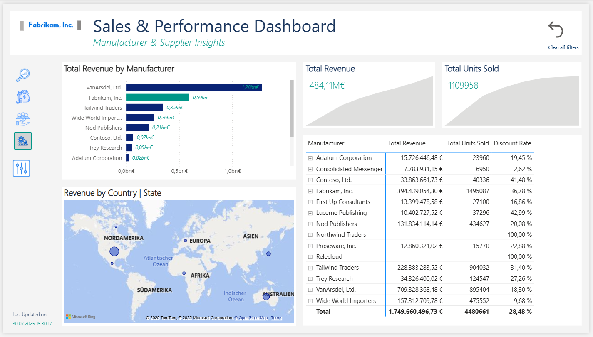
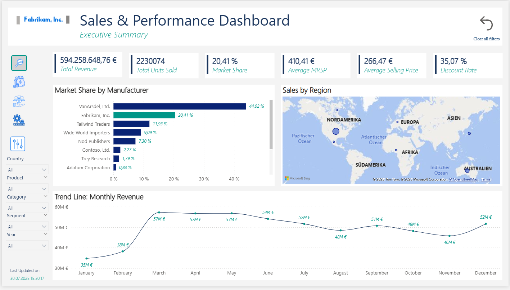

# Fabrikam, Inc. Sales & Performance Dashboard

A professional Power BI report analyzing product, pricing, and regional sales data for Fabrikam, Inc.. The dashboard includes executive-level insights, pricing strategy analysis, regional performance mapping, and manufacturer-level breakdowns.

🏢 About Fabrikam, Inc.

Fabrikam, Inc. is a fictional company commonly used by Microsoft in demo data and training materials. In this dataset, Fabrikam operates as a consumer electronics manufacturer and distributor, selling products through various manufacturers across different regions and market segments.

The company competes in a simulated retail market with other fictional brands such as Proseware, Inc., Contoso, and others — allowing users to explore realistic business scenarios without exposing real corporate data.
📦 About the Data Source

This project is based on the VanArsdel Ltd. sample dataset, published by Microsoft and often used in Power BI training. The dataset includes:

    Sales transactions (Revenue, Units)

    Product metadata (Category, Segment, MSRP)

    Geographic info (City, State, Region, Zip)

    Manufacturer details (e.g., Proseware, Fabrikam, etc.)

 📊 Report Pages

1. Executive Summary
   - High-level KPIs (Revenue, Units, Avg Price, MSRP Gap)
   - Revenue trend
   - Market share & regional summary

2. Product & Pricing Analysis
   - Category revenue
   - Price vs MSRP comparison
   - Discount rate by product and segment

3. Geography & Regional Performance
   - Revenue by region/state
   - Top cities
   - Regional trends over time

4. Manufacturer & Supplier Insights
   - Revenue by manufacturer
   - Avg discount %
   - Top products per manufacturer

## 🖼️ Screenshots

| Executive Summary | Product & Pricing Analysis|
|-------------------|----------------------------|
|  |  |

| Geography & Regional Analysis | Manufacturer & Seller Insights |
|-------------------------------|------------------------------|
|  |  |

| Executive Summary With Filters ON| 
|----------------------------------|
|  |

## 📁 Files

- `sales and performance dashboard.pbix` — Full Power BI report file

## 📌 Tools Used

- Power BI Desktop
- DAX
- Power Query

## 📬 Contact

Made by Fassil Yehuala
